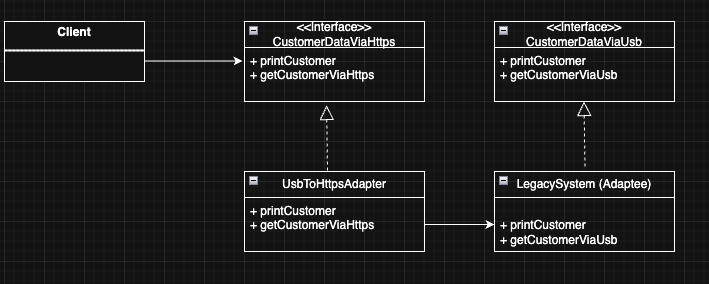

| CS-665       | Software Design & Patterns |
|--------------|----------------------------|
| Name         | Keith Kwan                 |
| Date         | 11/04/2025                 |
| Course       | Fall                       |
| Assignment # | 4                          |

# Assignment Overview

For assignment 4 we are tasked with joining a legacy system and a current system so that they can both be easily used by the client

# GitHub Repository Link:
https://github.com/kkeith88/cs-665-assignment-4

# Implementation Description 


For each assignment, please answer the following:

- Explain the level of flexibility in your implementation, including how new object types can
be easily added or removed in the future.
    - In this assignment, my implementation is highly flexible because the system is built around interfaces `CustomerDataViaUsb` and `CustomerDataViaHttps`. This allows for new data sources or connection types to be added in the future without modifying existing code.
    - Similarly, if another legacy system were introduced (for example, one that retrieves data from a local database instead of a USB drive), the adapter could be easily modified or replaced to work with that system
- Discuss the simplicity and understandability of your implementation, ensuring that it is
easy for others to read and maintain.
    - My approach was to keep the design simple and easy to follow, while still demonstrating a clear use of the Adapter design pattern.
        - The legacy system `LegacySystem` simulates customer data stored on a USB drive.
        - The new system `CustomerDataViaHttps` defines how customer data should be accessed over HTTPS.
        - The adapter `UsbToHttpsAdapter` bridges the two, making the legacy system compatible with the new system’s interface.
    - A future developer can easily identify that the adapter connects the two systems because of the straightforward class naming and comments throughout the code

- Describe how you have avoided duplicated code and why it is important.
    - In this assignment I avoided code duplication by centralizing the customer data retrieval logic in their own respective files. By doing so I was able to keep the adapter as simple as possible by delegating the functionality. In future iterations of this assignment, adding another legacy system would be fairly straightforward.
- If applicable, mention any design patterns you have used and explain why they were
chosen.
    - For this assignment, the I chose to use the object adapter pattern. The pattern was chose because the requirements of the assignment were to integrate 2 incompatible systems. By using the adapter I can allow the client to communicate without modifying the existing "code" in either system. The adapter would prove to be even more useful if this was a larger project and we really did not want to modify or refactor existing code.

### Design Choices / Assumptions / Thought Process:
Initially when reading the assignment requirements it stated that we needed something to facilitate the integration of 2 non compatible systems. This lead me to choose the adapter pattern based on my memory from class instruction. By using the uml from the slides as a guide it became pretty clear what classes I would need.

Also the on the assignment it notes, you’ll need to be able to use the new system’s interface with the old system’s API, I interpreted this as making the old api useable with the new system. So taking the legacy one and making it compatible with future code.


# UML Diagram



# Maven Commands

We'll use Apache Maven to compile and run this project. You'll need to install Apache Maven (https://maven.apache.org/) on your system. 

## Compile
Type on the command line: 

```bash
mvn clean compile
```


## JUnit Tests
JUnit is a popular testing framework for Java. JUnit tests are automated tests that are written to verify that the behavior of a piece of code is as expected.

To run, use the following command:
```bash
mvn clean test
```


## Spotbugs 

SpotBugs is a static code analysis tool for Java that detects potential bugs in your code.
Use the following command:

```bash
mvn spotbugs:gui 
```

For more info see 
https://spotbugs.readthedocs.io/en/latest/maven.html

SpotBugs https://spotbugs.github.io/ is the spiritual successor of FindBugs.


## Checkstyle 

Checkstyle is a development tool for checking Java source code against a set of coding standards.
The following command will generate a report in HTML format that you can open in a web browser. 

```bash
mvn checkstyle:checkstyle
```

The HTML page will be found at the following location:
`target/site/checkstyle.html`


